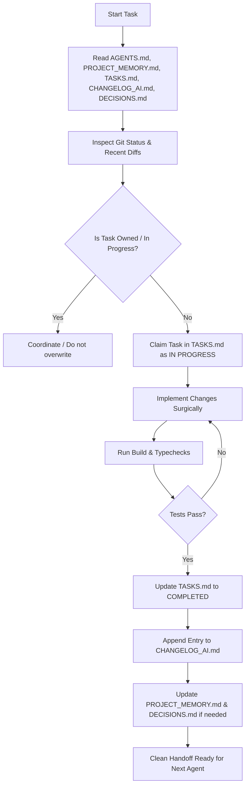

# Multi-Agent Workflow: Step-by-Step Lifecycle

## Detailed Steps

### Step 1: Ingestion of State
Before running any code generation or planning:
- Open `AGENTS.md` and review active constraints.
- Open `PROJECT_MEMORY.md` to ensure mental model aligns with the actual repo.
- Open `TASKS.md` to understand what other agents (Kilo Code / Antigravity) are doing.
- Open `CHANGELOG_AI.md` to see recent modifications.
- Open `DECISIONS.md` to align with ADRs.

### Step 2: Workspace & Git Verification
- Run `git status` to see unstaged changes.
- Check target files directly before proposing replacements.

### Step 3: Task Locking
- Update `TASKS.md` by moving the task under `🔴 IN PROGRESS` with your Agent name.

### Step 4: Implementation
- Implement the minimal, robust change set required.
- Do not refactor unrelated modules.

### Step 5: Verification
- Execute `npm run build` or `npx tsc --noEmit` to verify type and build integrity.

### Step 6: Memory Synchronization (Handoff)
- Update `TASKS.md` -> `🟢 COMPLETED`.
- Record detailed entry in `CHANGELOG_AI.md`.
- Synchronize `PROJECT_MEMORY.md` and `DECISIONS.md`.
